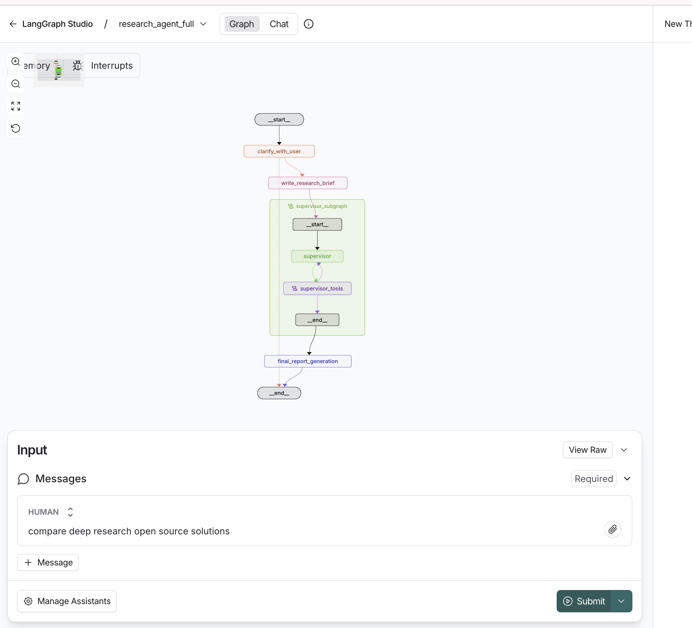

# SleekResearcher

Adaptation from [deep_research_from_scratch](https://github.com/langchain-ai/deep_research_from_scratch) and  [open_deep_research](https://github.com/langchain-ai/open_deep_research) repositories.This repo offers a comprehensive multi-agent research system built with LangGraph that orchestrates deep research workflows through specialized agents. The system combines scoping, research coordination, and report generation to deliver thorough research reports on any topic.

## Features

- **Multi-Agent Architecture**: Coordinated research using specialized agents for different aspects of the research process
- **Scoping & Clarification**: Interactive user clarification to refine research requirements
- **Parallel Research**: Multiple researcher agents work simultaneously on different aspects of a topic
- **Supervisor Coordination**: Central supervisor agent manages and coordinates research activities
- **Comprehensive Reporting**: Automated generation of detailed research reports
- **LangGraph Platform Integration**: Deploy and run on LangGraph platform for scalable research workflows

## Installation

### Prerequisites

- Python 3.11 or higher
- [uv](https://docs.astral.sh/uv/) package manager

### Setup

1. **Clone the repository**
   ```bash
   git clone <repository-url>
   cd sleek-researcher
   ```

2. **Install dependencies**
   ```bash
   uv sync
   ```

3. **Set up environment variables**
   ```bash
   cp .env.example .env
   # Edit .env with your API keys (OpenAI, Anthropic, Tavily, etc.)
   ```

4. **Install LangGraph CLI for platform deployment**
   ```bash
   uv add "langgraph-cli[inmem]"
   ```

## Usage

### Run on LangGraph Platform

```bash
langgraph dev
```

This will start the LangGraph development server with all available research agents:
- `scope_research`: User clarification and scoping
- `research_agent`: Basic research agent
- `research_agent_mcp`: Research agent with MCP tools
- `research_agent_supervisor`: Multi-agent supervisor
- `research_agent_full`: Complete end-to-end research workflow

### Run Individual Components

You can also run specific components directly:

```bash
# Scoping agent
python src/run_scoping_graph.py

# Research agent
python src/run_research_graph.py

# Full multi-agent system
python src/run_full_agent_graph.py
```


| Scoping                                                  | Researcher                               | Supervisor                             | end-to-end Agent                                                            |
|----------------------------------------------------------|----------------------------------------|--------------------------------------|-----------------------------------------------------------------------------|
|  | ||   |


## Scoping


## Researcher


## Supervisor


## Full end-to-end Agent


